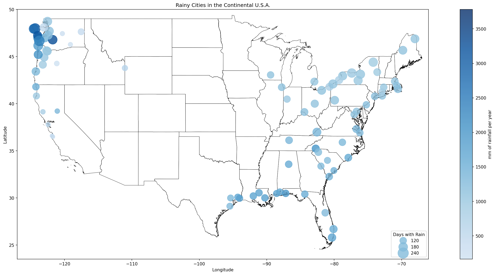

NOAA Precipitation Data: Exploring Rainy Weather in the U.S.
============================================================ 

*A rainy & foggy afternoon in NYC (src: Wikimedia Commons)*

Useful Definitions & Acronyms for the Uninitiated:
==================================================
- **NOAA:** National Oceanic and Atmospheric Administration; the US agecy responsible for for dealing with climate and the like
- **NCEI:** National Centers for Environmental Information; an entity under the **NOAA** that collects and distributes environmental data
- **USGS:** United States Geological Survey; the US agency responsible for monitoring landscape & natural resources
- **CDO:** Climate Data Online; a service that makes the NOAA's climate data accessible over the web
- **Geospatial:** Data that is associated with a location, e.g. height stored as a function of global coordinates
- **GIS:** Geographic Information Systems: Any software that has to do with geographic data
- **OGC:** Open Geospatial Consortium; a cooperative entity that creates standards for GIS data. Note: sometimes called **OpenGIS** as well
- **WMS:** Web Map Service; one of those OGC standardizations for an interface for requesting "map data" (images of geospatial data) from a server
- **NBD:** National Boundaries Dataset; the USGS's geospatial data, accessible online through a WMS, of global boundaries. There are boundaries for countries, US states, reservations, protected lands, you name it.

Results:
========
What is the rainiest city in the U.S.?  Depending on the parameters of your argument and how you choose to quantify this, that question has a few answers.
By the metric of days with rain per year, the top five cities (reasonably large ones) are:

.. list-table:: Rainiest Cities by Days of Rainfall
   :widths: 35 60
   :header-rows: 1

   * - City
     - Median no. of rainy days per year from 2012-2021
   * - Rochester, NY
     - 179.5
   * - Syracuse,NY
     - 174.5
   * - Seattle,WA
     - 168.5
   * - Buffalo, NY
     - 167.0
   * - Cleveland,OH
     - 163.0

But if you consider any size urban area (towns, cities, etc.), the list is completely different:

.. list-table:: Rainiest Towns & Cities by Days of Rainfall
   :widths: 35 60
   :header-rows: 1

   * - City
     - Median no. of rainy days per year from 2012-2021
   * - Hilo, HI
     - 270.5
   * - Annette, AK
     - 237.0
   * - Forks,WA
     - 224.5
   * - Raymond, WA
     - 220.0
   * - Quillayute, WA
     - 196.0
   * - Astoria, OR
     - 194.0
   * - Aberdeen, WA
     - 193.0
   * - Hoquiam, WA
     - 182.5
   * - Paradise, WA
     - 182.0
   * - Rochester, NY
     - 179.5

But what about other ways to quantify "rainiest"?  Does the amount of rain count for nothing.

.. list-table:: Rainiest Towns & Cities by Total Rainfall
   :widths: 35 60
   :header-rows: 1

   * - City
     - Median mm of rain per year from 2012-2021
   * - Annette
     - 3782.85
   * - Paradise
     - 3275.50
   * - Quinault
     - 3166.45
   * - Forks
     - 3103.75
   * - Hilo
     - 3007.15
   * - Quillayute
     - 2733.55
   * - Aberdeen
     - 2336.75
   * - Raymond
     - 2326.75
   * - Tillamook
     - 2032.15
   * - Brevard
     - 1997.40

But what about the most total precipitation?  If we include snow, looking at towns and cities:

.. list-table:: Cities with the Most Total Precipitation
   :widths: 35 60
   :header-rows: 1

   * - City
     - Median mm of total precipitation per year from 2012-2021
   * - Presque Isle, ME
     - 4444.65
   * - Syracuse, NY
     - 43962.00
   * - Annette, AK
     - 3782.85
   * - Driggs, ID
     - 3769.45
   * - Brassau Dam, ME
     - 3572.30

See more extensive tables in `the main notebook. <./city_comparison/city_comparison.ipynb>`_

Here are all of the cities (without Annette, AK) on a U.S. Map:

and Washington State as well:

.. image:: ./assets/precipitation_map_02.png
  :width: 600
  :alt: Map of the Washington State with rainy cities shown

Resources:
==========
- `Precipitation Data Overview <https://www.ncei.noaa.gov/metadata/geoportal/rest/metadata/item/gov.noaa.ncdc:C00947/html>`_ on the NOAA website
- `Data Access Homepage <https://www.ncei.noaa.gov/access>`_ on the NOAA website
- `GSOY data search <https://www.ncei.noaa.gov/access/search/data-search/global-summary-of-the-year>`_ on the NOAA site
- `GSOY data README <https://www.ncei.noaa.gov/pub/data/metadata/documents/GSOYReadme.txt>`_ on the NOAA site
- `Weather Stations & their locations <https://www.ncei.noaa.gov/pub/data/ghcn/daily/ghcnd-stations.txt>`_ on the NOAA site
- `Information on the WMS standart <https://www.ogc.org/standard/wms/>`_ from the OGC
- `WMS GetCapabilities request <https://www.sciencebase.gov/catalogMaps/mapping/ows/4f70b219e4b058caae3f8e19?service=wms&request=getcapabilities&version=1.3.0>`_ for the **USGS** **NBD**
- `OWSLib Documentation <https://owslib.readthedocs.io/en/latest/>`_ (helpful python library)
